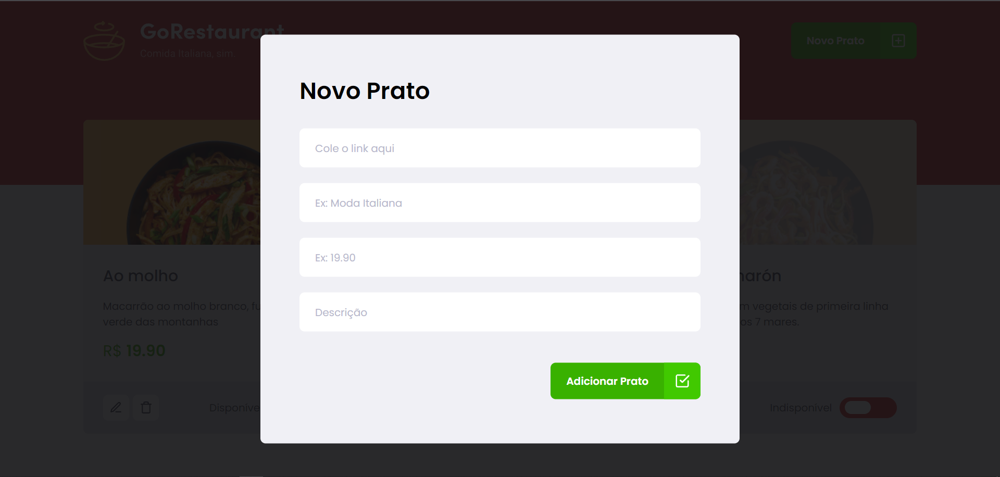
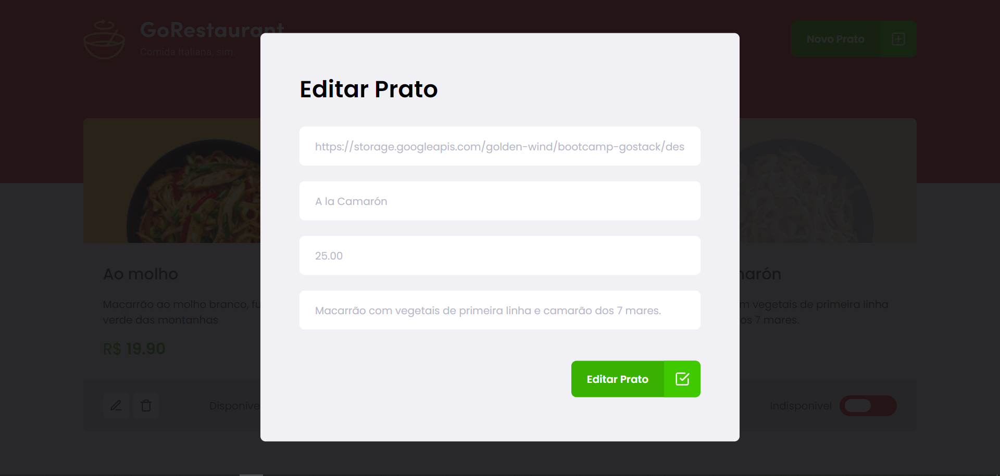

<div align="center">

</div>
</br>
<h2> Desafio </h2>

<p>
    Processos de migração: de Javascript para Typescript e de Class Components para Function Components.
</p>

<h2> Template da aplicação </h2>

<a href="https://github.com/rocketseat-education/ignite-template-reactjs-refactoring-classes-ts"> Aqui </a>


<h2> API fake </h2>

- Usando o <a href="https://github.com/typicode/json-server">JSON serve</a> será simulado uma api com dados das comidas do restaurante;
- Rodando o Json:

```
// execute os comandos no terminal dentro do projeto

yarn
yarn server

```

<h2> Executando o projeto </h2>

```
// execute os comandos no terminal dentro do projeto

yarn start

```

<h2> O projeto </h2>





